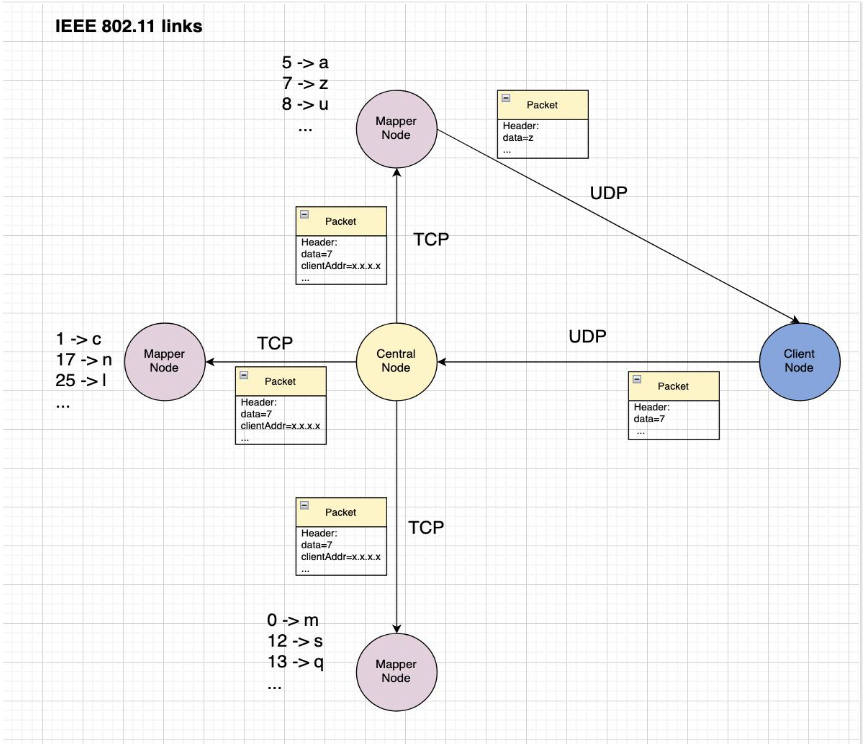

# CN-CA2🌐
## Computer Network CA2. 📡

### Amir-Hossein Shahgholi (SID: 810199441)🎓

### Erfan-Soleymani (SID: 810199439)🎓
 

In this assignment we build a wireless topology containing one `client` node, one `central(master)` node and 3 mapper nodes.
Client generate random numbers between 0-25 and send these data to master nodes and then master node send these data to all 3 mapper nodes and in the next step mapper that contains proper mapping for this data decodes this data to corresponding charecter and send this data back to client.
Client connects to central node using `UDP`, client connects to mappers using `TCP` and mappers connects to client using `UDP`.

